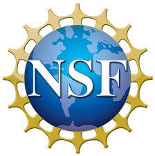
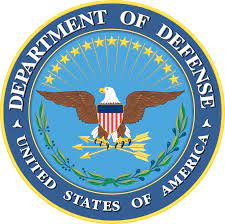

# Biographies

### Alec Pugh

Alec Pugh is a rising junior at UNC-Chapel Hill. His interest in aviation and algorithms led him to the research of UAVs, a field that involves both. After graduation, his plan is to pursue a graduate degree in Computer Science and then work in either industry or academia. In his free time, he likes to solve coding puzzles, fly seaplanes, and make music. 

  

### Luke Bower

Luke Bower is a sophomore computer science student from the University of Alabama in Huntsville who is also getting a math minor. He fell in love with Computer Science in middle school after finding out how unsecure the cyber world is. He has always wanted to try and make society better and he felt like computer science was the method to achieve it. Having the previous knowledge of UAVs being used for surveillance and defense, it fell into his desire to protect society and that is why he wanted to help contribute to the research in this field. Once Luke graduates he plans on working for the FBI doing digital forensics and later getting his master's degree in Computer Science.   

  

# Acknowledgement
We would like to thank the NSF(National Sicence Foundation), Department of Defence, and Auburn Univeristy for hosting, operating, and funding our research. We would also like to thank Dr. Richard Chapman and Dr. Saad Biaz for hosting and orgnizing our weekly agendas.

  
  
  

# Contact Us

### Alec Pugh
Email: alecjp[at]unc.edu

### Luke Bower
Email: lcb0035[at]uah.edu
