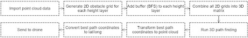

# 2022 REU on Smart UAVs

## Abstract
With the growing use of unmanned aerial vehicles UAVs for commercial and military operations, path efficiency remains an utmost concern for battery and time preservation. This paper presents a method for three dimensional 3D path planning using point clouds obtained from the USGS 3DEP United States Geological Survey 3D Elevation Program dataset via Open Topography. The path itself is obtained using the A* algorithm, with additional modifications implemented to account for path smoothing, UAV size, and energy consumption. We also introduce a collision avoidance method using the precomputed data to account for unforeseen obstacles not rendered within the point cloud. The method presented is designed specifically for point clouds obtained via LiDAR Light Detection and Ranging scans from aircraft, where cavities may be present underneath the surface layer. Simulations and physical testing using way point transmission show the validity of this method.

## UML diagram of program

  

## This is where we have a window with the PDF of our paper

<!-- <embed src="https://raw.githubusercontent.com/alecstem/REUWebsite/gh-pages/2022_REU_on_Smart_UAVs.pdf" width="100%" height="850px"/> -->
